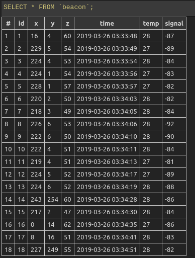
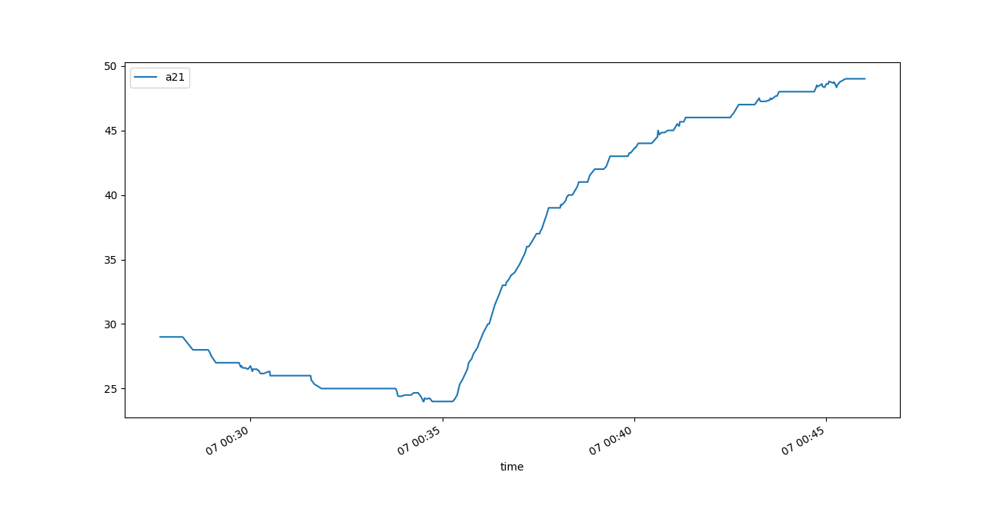
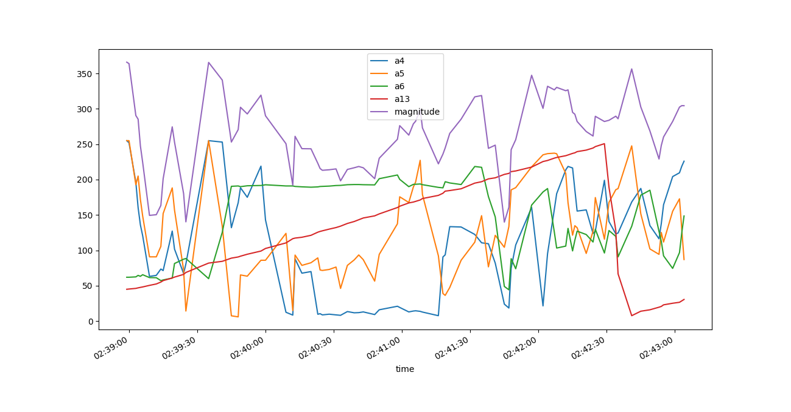
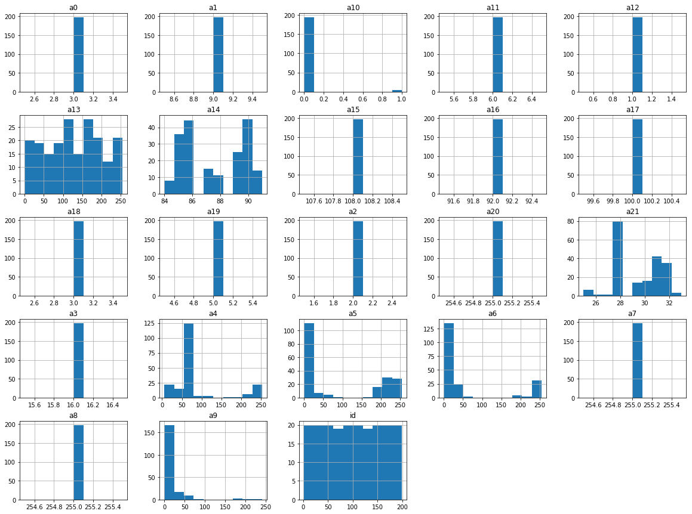
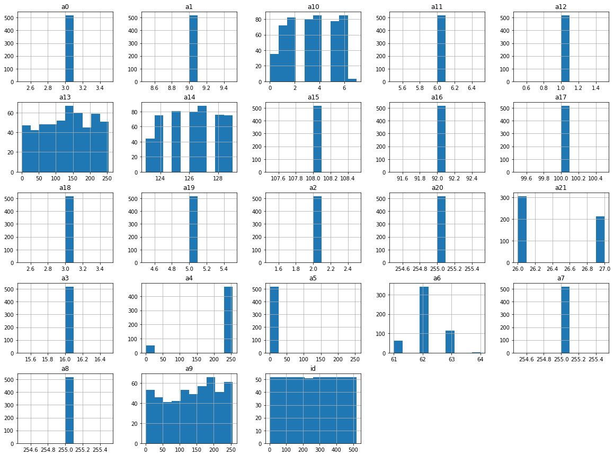
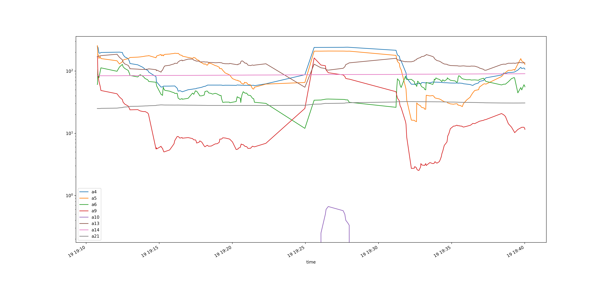
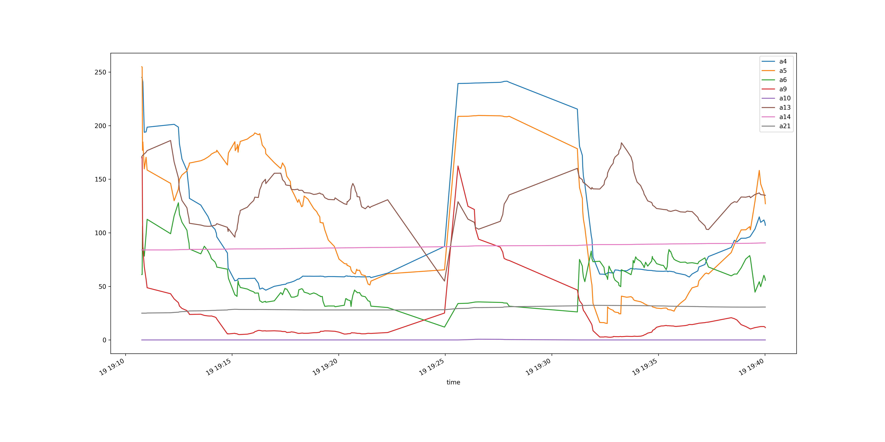
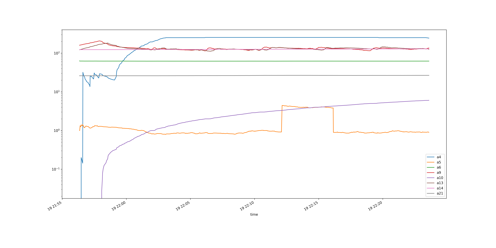
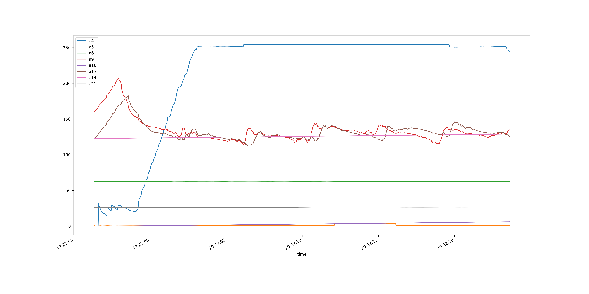

# Beacon sniffer

Test script for debug the beacons.

## Installation

You must to install node v9 for ARMv7 devices.  Follow [this](https://www.instructables.com/id/Install-Nodejs-and-Npm-on-Raspberry-Pi/) tutorial. Also, follow noble instruction for install [noble](https://github.com/noble/noble).
### install node v9
```
cd ~/

get https://nodejs.org/dist/latest-v9.x/node-v9.11.2-linux-armv7l.tar.xz

tar -xf node-v9.11.2-linux-armv7l.tar.xz

cd node-v9.11.2-linux-armv7l/
sudo cp -R * /usr/local/

node -v
npm -v

```
### How to run the main app.

Run the app with 
```
sudo node app.js

```

This will log the telemegry data for the debug device into the *.sqlite3 , and will output in the console:

```json
pi@raspberrypi:~/bluetooth-rpi-beacon $ cat logs_app 
[INFO] Database created!
Starting scan...
Scanning started.
TABLE CREATED with response: [object Object]
{
	"addrs": "c1:93:da:19:eb:cd",
	"rssiDB": -87,
	"manufacturer": "Kontakt",
	"uuid": "fe6a",
	"telemetry": {
		"timeStamp": "2019-03-26 03:33:48",
		"x": 16,
		"y": 4,
		"z": 60,
		"temp": 28
	}
}
[INFO] Inserting data
Data INSERTED with log [object Object]
{
	"addrs": "c1:93:da:19:eb:cd",
	"rssiDB": -89,
	"manufacturer": "Kontakt",
	"uuid": "fe6a",
	"telemetry": {
		"timeStamp": "2019-03-26 03:33:49",
		"x": 229,
		"y": 5,
		"z": 54,
		"temp": 27
	}
}
[INFO] Inserting data
Data INSERTED with log [object Object]
{
	"addrs": "c1:93:da:19:eb:cd",
	"rssiDB": -84,
	"manufacturer": "Kontakt",
	"uuid": "fe6a",
	"telemetry": {
		"timeStamp": "2019-03-26 03:33:54",
		"x": 224,
		"y": 4,
		"z": 53,
		"temp": 28
	}
}

```

## Update 25.mar.2019

Refactor of insertData methods so the beacon can log the gyro, temp signal data into the SQL in the format:

<div style="text-align:center"></div>

The process of data collection for the algorithm creation has begun...

## Update 06.mar.2019

* Added temperature address from 22 lenght vector
<div style="text-align:center"></div>

* Added main frontend scripts for draw time series data into the folder `frontend/index.hmtl`

### TODO
* Add Temperature value to the JSON Log
* Implement REST API for get data values and plot live charts with the data using the frontend scripts.
* Implement main classification algorithm for move/no-move.

## Update 27.feb.2019
Thanks to the plots, we identify the x y z componets of the telemetry in the array with 22 length. The next plot shows the behavior of moving the beacon in a table in X , later in Y and the Z componets.

<div style="text-align:center"></div>

`a13` seems to be some kind of Force Sensor , accidentally I drop the device to the floor and this down in the graph for `a13` reflect this event.

### Refactor

A refactor process was made in the repo, now the principal modules of the script are in separate folders and sub classes. You can run the application with:

```console
pi@raspberrypi:~/beacons $ sudo node app.js
```

with the following log:


```bash
pi@raspberrypi:~/bluetooth-rpi-beacon $ sudo node app.js 
Database created!
Starting scan...
Scanning started.
{
	"addrs": "c1:93:da:19:eb:cd",
	"rssiDB": -75,
	"manufacturer": "Kontakt",
	"uuid": "fe6a",
	"telemetry": {
		"timeStamp": "2019-02-27 05:14:26",
		"x": 232,
		"y": 205,
		"z": 246
	}
}
{
	"addrs": "c1:93:da:19:eb:cd",
	"rssiDB": -73,
	"manufacturer": "Kontakt",
	"uuid": "fe6a",
	"telemetry": {
		"timeStamp": "2019-02-27 05:14:39",
		"x": 36,
		"y": 42,
		"z": 25
	}
}
{
	"addrs": "c1:93:da:19:eb:cd",
	"rssiDB": -74,
	"manufacturer": "Kontakt",
	"uuid": "fe6a",
	"telemetry": {
		"timeStamp": "2019-02-27 05:14:40",
		"x": 63,
		"y": 231,
		"z": 241
	}
}
{
	"addrs": "c1:93:da:19:eb:cd",
	"rssiDB": -60,
	"manufacturer": "Kontakt",
	"uuid": "fe6a",
	"telemetry": {
		"timeStamp": "2019-02-27 05:14:41",
		"x": 13,
		"y": 244,
		"z": 194
	}
}
{
	"addrs": "c1:93:da:19:eb:cd",
	"rssiDB": -67,
	"manufacturer": "Kontakt",
	"uuid": "fe6a",
	"telemetry": {
		"timeStamp": "2019-02-27 05:14:42",
		"x": 12,
		"y": 244,
		"z": 195
	}
}
...

```


### TODO 
* Identify the Temperature Service Address (wth the service discovery script)


## Update
Once the telemetry is activated in the beacon, we can access to the new peripheral.address ```c1:93:da:19:eb:cd```, this peripheral address emit 3 vector arrays types, from which we are just interested in the array with length of 22 .
* [3,9,2,16,0,2,62,255,255,224,12,6,1,185,135,108,92,100,3,5,255,27]


The example array has the properties for detect the beacon movements. We log this information into a my_db*.sqlite3 database. Here is the plot for the values of the array in a time series fashion, the most important arrays are the ones which are ploted below.

#### Feature imporance

The feature importance was checked using a histrogram for the timeseries data.
 The feature importance is showed below:

#### For Movement case
<div style="text-align:center"></div>

#### For Static case
<div style="text-align:center"></div>

There are 22 features, from which it seems that just 8 participate in the movement-sensors.

#### For Movement case

For this scenario, the beacon was carried by a pedestrian for around 30 min, the movement of the pedestrian is displayed below.

With y-logaritmic scale
<div style="text-align:center"></div>

With normal scale:
<div style="text-align:center"></div>

#### For the Static case

In this state the beacon is left on a table for around 20 minutes.

With y-logaritmic scale

<div style="text-align:center"></div>

With normal scale
<div style="text-align:center"></div>


## How to debug devices

For find beacon devices:

```console
pi@raspberrypi:~/beacons $ sudo node advertisement-discovery.js
```
The result is:

```bash
peripheral discovered (cd1244573708 with address <cd:12:44:57:37:08, random>, connectable false, RSSI -20:
	hello my local name is:
		undefined
	can I interest you in any of the following advertised services:
		["feaa"]
	here is my service data:
		"feaa": "00dcf7826da6bc5b71e0893e65666a6e4e64"

peripheral discovered (f40dc8467fc6 with address <f4:0d:c8:46:7f:c6, random>, connectable true, RSSI -44:
	hello my local name is:
		Kontakt
	can I interest you in any of the following advertised services:
		[]
	here is my service data:
		"fe6a": "0208010364f452737669485a"

peripheral discovered (e7dadf9ced70 with address <e7:da:df:9c:ed:70, random>, connectable false, RSSI -21:
	hello my local name is:
		undefined
	can I interest you in any of the following advertised services:
		[]
	here is my manufacturer data:
		"4c000215f7826da64fa24e988024bc5b71e0893ee92392f3b3"

```

For check the peripherals info:

```console
pi@raspberrypi:~/beacons $ sudo node peripheral-discover.js cd1244573708
```

```bash
peripheral with ID cd1244573708 found
  Service Data      = [
  {
    "uuid": "feaa",
    "data": {
      "type": "Buffer",
      "data": [
        16,
        220,
        2,
        107,
        110,
        116,
        107,
        46,
        105,
        111,
        47,
        101,
        100,
        100,
        121,
        115,
        116,
        111,
        110,
        101
      ]
    }
  }
]
  Service UUIDs     = feaa

services and characteristics:

Fase de escaneo BLE finalizada

PERIPHERAL Peripheral {
  _noble: 
   Noble {
     initialized: true,
     address: 'b8:27:eb:91:8b:c4',
     _state: 'poweredOn',
     _bindings: 
      NobleBindings {
        _state: 'poweredOn',
        _addresses: [Object],
        _addresseTypes: [Object],
        _connectable: [Object],
        _pendingConnectionUuid: null,
        _connectionQueue: [],
        _handles: {},
        _gatts: {},
        _aclStreams: {},
        _signalings: {},
        _hci: [Hci],
        _gap: [Gap],
        _events: [Object],
        _eventsCount: 21,
        onSigIntBinded: [Function: bound ],
        _scanServiceUuids: [] },
     _peripherals: { e7dadf9ced70: [Peripheral], cd1244573708: [Circular] },
     _services: { e7dadf9ced70: {}, cd1244573708: {} },
     _characteristics: { e7dadf9ced70: {}, cd1244573708: {} },
     _descriptors: { e7dadf9ced70: {}, cd1244573708: {} },
     _discoveredPeripheralUUids: [ 'e7dadf9ced70', 'cd1244573708' ],
     _events: 
      { warning: [Function: bound ],
        newListener: [Function: bound ],
        stateChange: [Function],
        discover: [Function] },
     _eventsCount: 4,
     _allowDuplicates: undefined },
  id: 'cd1244573708',
  uuid: 'cd1244573708',
  address: 'cd:12:44:57:37:08',
  addressType: 'random',
  connectable: false,
  advertisement: 
   { localName: undefined,
     txPowerLevel: undefined,
     manufacturerData: undefined,
     serviceData: [ [Object] ],
     serviceUuids: [ 'feaa' ],
     solicitationServiceUuids: [],
     serviceSolicitationUuids: [] },
  rssi: -47,
  services: null,
  state: 'disconnected' }

```
For check the traffic:

```console
pi@raspberrypi:~/beacons $ sudo node puck.js
```

The result for MAC cd:12:44:57:37:08 is
```bash

cd:12:44:57:37:08 -72 undefined undefined [ 32, 0, 11, 167, 31, 64, 6, 152, 167, 215, 6, 28, 216, 90 ]
cd:12:44:57:37:08 -71 undefined undefined [ 32, 0, 11, 167, 31, 64, 6, 152, 167, 230, 6, 28, 216, 100 ]
cd:12:44:57:37:08 -73 undefined undefined [ 32, 0, 11, 167, 31, 0, 6, 152, 167, 245, 6, 28, 216, 120 ]
cd:12:44:57:37:08 -74 undefined undefined [ 32, 0, 11, 167, 31, 64, 6, 152, 168, 7, 6, 28, 216, 130 ]
cd:12:44:57:37:08 -59 undefined undefined [ 32, 0, 11, 167, 31, 0, 6, 152, 168, 22, 6, 28, 216, 140 ]
cd:12:44:57:37:08 -73 undefined undefined [ 32, 0, 11, 167, 31, 0, 6, 152, 168, 88, 6, 28, 216, 200 ]

cd:12:44:57:37:08 -31 undefined undefined [ 32, 0, 11, 167, 34, 0, 6, 152, 178, 222, 6, 28, 226, 0 ]
cd:12:44:57:37:08 -17 undefined undefined [ 32, 0, 11, 167, 34, 0, 6, 152, 178, 240, 6, 28, 226, 10 ]
cd:12:44:57:37:08 -45 undefined undefined [ 32, 0, 11, 167, 33, 192, 6, 152, 178, 255, 6, 28, 226, 30 ]
cd:12:44:57:37:08 -44 undefined undefined [ 32, 0, 11, 167, 34, 0, 6, 152, 179, 17, 6, 28, 226, 40 ]
cd:12:44:57:37:08 -31 undefined undefined [ 32, 0, 11, 167, 34, 64, 6, 152, 179, 32, 6, 28, 226, 60 ]
cd:12:44:57:37:08 -46 undefined undefined [ 32, 0, 11, 167, 34, 0, 6, 152, 179, 47, 6, 28, 226, 70 ]
cd:12:44:57:37:08 -45 undefined undefined [ 32, 0, 11, 167, 33, 192, 6, 152, 179, 80, 6, 28, 226, 100 ]
cd:12:44:57:37:08 -45 undefined undefined [ 32, 0, 11, 167, 33, 192, 6, 152, 179, 98, 6, 28, 226, 110 ]
cd:12:44:57:37:08 -16 undefined undefined [ 32, 0, 11, 167, 33, 192, 6, 152, 179, 131, 6, 28, 226, 140 ]
cd:12:44:57:37:08 -18 undefined undefined [ 32, 0, 11, 167, 34, 0, 6, 152, 179, 146, 6, 28, 226, 160 ]
cd:12:44:57:37:08 -18 undefined undefined [ 32, 0, 11, 167, 34, 0, 6, 152, 179, 179, 6, 28, 226, 180 ]
cd:12:44:57:37:08 -30 undefined undefined [ 32, 0, 11, 167, 34, 0, 6, 152, 179, 194, 6, 28, 226, 200 ]

```

Uncomment the line 12 in [puck.js](./puck.js) for full log for all the aviable services from beacons.


## TODOS
* Log rssi signal strength in the sqlite db.
* Refactor important functions in the code.
* Implement a timeseries plot in html and javascript, for real-time movement display in the browser.
* Implement algorithm for classify movement/no-movement from data
* Log this classification in other sqlite db.

## References
* https://qiita.com/tinoue@github/items/17ca0046013f6ae76853
* https://github.com/noble/noble/issues/673
* [GOOD_GOOD_REFERENCE](https://www.espruino.com/Puck.js+Advertising)
* https://github.com/adafruit/Adafruit_Python_BluefruitLE
* https://github.com/noble/noble/issues/552#issuecomment-288995711
* https://github.com/noble/noble/issues/552
* https://github.com/noble/noble/issues/329
* [Cheat_Sheet](https://ukbaz.github.io/howto/beacon_scan_cmd_line.html)
* https://github.com/IanHarvey/bluepy
* https://github.com/sandeepmistry/node-bleacon
* https://www.switchdoc.com/2014/08/ibeacon-raspberry-pi-scanner-python/
* https://developer.kontakt.io/hardware/sensors/
* https://github.com/noble/noble/issues/685
* https://github.com/noble/noble/issues/690 
* https://github.com/noble/noble/issues/807
* https://github.com/noble/noble/issues/824
* https://github.com/noble/noble/issues/845
* https://github.com/noble/noble/issues/846
* https://github.com/noble/noble/issues/854
* https://scribles.net/running-ble-advertising-example-code-on-raspbian-stretch/
